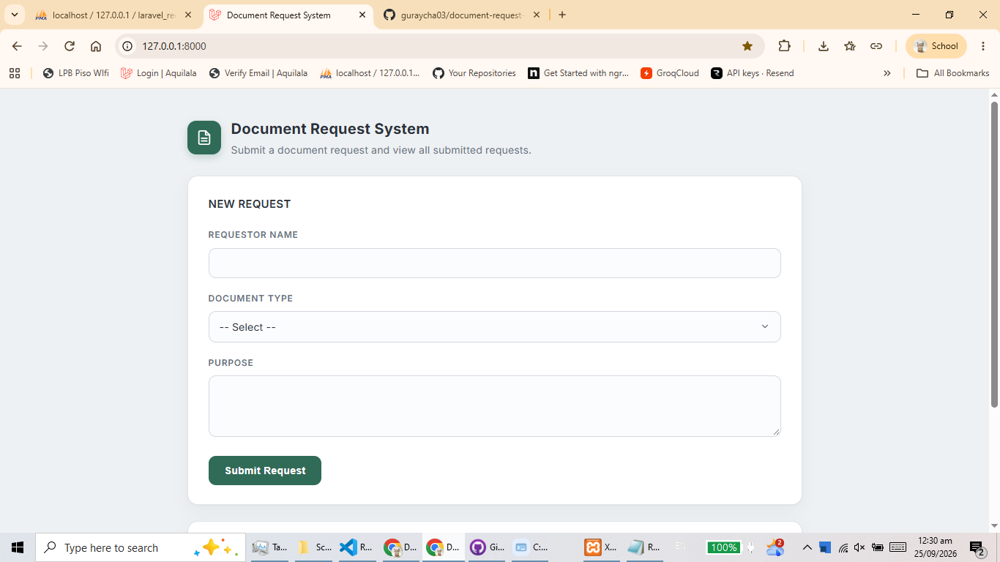

# Document Request and Generation System

A Laravel-based web application for submitting document requests and generating requested documents.

Laboratory 1 — ESTABLISH THE LARAVEL PROJECT AND MAP ITS DEVOPS WORKFLOW

## Screenshots



> Screenshot to be added.

## Student Information

- Samantha Bianca Germina
- Charisse G. Guray
- **Course/Year/Section:** BSIT 4-3

## Technologies Used

- Laravel 13.33.0
- PHP 8.3.16
- Composer 2.9.5
- MySQL
- XAMPP
- Git / GitHub

## Software Requirements (Prerequisites)

Before running the project, make sure the following are installed and available on your system:

| Software | Minimum Version | Purpose |
| -------- | --------------- | ------- |
| PHP | 8.3.0 or higher | Laravel runtime |
| Composer | 2.0 or higher | Dependency management |
| MySQL | 5.7 or higher | Database server |
| XAMPP | Latest | Provides Apache + MySQL (phpMyAdmin) |
| Git | Latest | Version control / cloning the repository |
| Web browser | Latest | Accessing the application |

## Installation & Setup

Follow these steps to run the project locally.

### 1. Clone the Repository

```bash
git clone https://github.com/guraycha03/document-request-system.git
cd document-request-system
```

### 2. Install PHP Dependencies

```bash
composer install
```

### 3. Configure the Environment

Copy `.env.example` to `.env`:

```bash
copy .env.example .env
```

Then generate the application key:

```bash
php artisan key:generate
```

### 4. Configure the Database

1. Start **Apache** and **MySQL** from the XAMPP Control Panel.
2. Open **phpMyAdmin** at `http://localhost/phpmyadmin`.
3. Create a database named:

```
laravel_request_system_db
```

#### Option A — Import the Database (SQL file)

If you have a database dump file (`.sql`), import it:

1. In phpMyAdmin, select the `laravel_request_system_db` database.
2. Go to the **Import** tab.
3. Choose the `.sql` file and click **Go**.

#### Option B — Create the Tables via Migrations

Update the database settings in your `.env` file:

```env
DB_CONNECTION=mysql
DB_HOST=127.0.0.1
DB_PORT=3306
DB_DATABASE=laravel_request_system_db
DB_USERNAME=root
DB_PASSWORD=
```

Then run the migrations and seeders to create the tables:

```bash
php artisan migrate
php artisan db:seed
```

Verify the tables were created:

```bash
php artisan migrate:status
```

### 5. Run the Development Server

```bash
php artisan serve
```

Open your browser and visit:

```
http://127.0.0.1:8000
```

## Project Structure

```
app/Models/          Eloquent models (User, DocumentRequest)
database/migrations/ Database table migrations
routes/web.php       Web route definitions
resources/views/     Blade views/templates
```

## Summary of Commands

| Step | Command |
| ---- | ------- |
| Install dependencies | `composer install` |
| Create `.env` file | `copy .env.example .env` |
| Generate app key | `php artisan key:generate` |
| Run migrations | `php artisan migrate` |
| Run seeders | `php artisan db:seed` |
| Start the server | `php artisan serve` |
| Access the app | `http://127.0.0.1:8000` |

## License

This project is for academic purposes (Laboratory 1, BSIT 4-3).