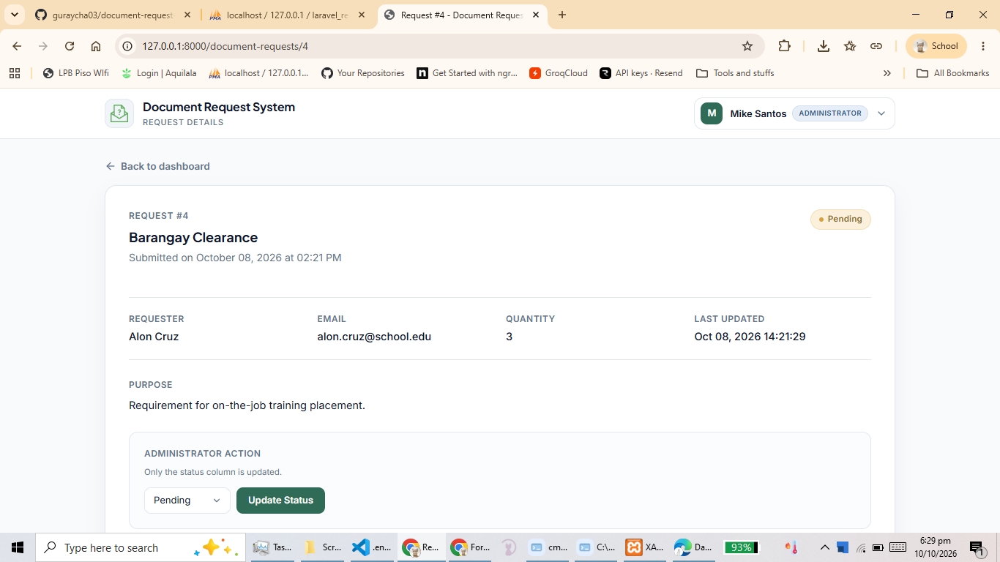

# Document Request and Generation System

A Laravel-based web application for submitting document requests and generating requested documents.

Laboratory 1 — ESTABLISH THE LARAVEL PROJECT AND MAP ITS DEVOPS WORKFLOW  
Laboratory 2 — PLAN AND IMPLEMENT THE REQUEST DATA MODEL  
Laboratory 3 — IMPLEMENT ROLE-BASED ACCESS AND USER ID OWNERSHIP

## Screenshots




## Student Information

- Samantha Bianca Germina
- Charisse G. Guray
- **Course/Year/Section:** BSIT 4-3

## User Stories (Laboratory 2)

> *Recorded for Laboratory 2. These three roles were replaced in Laboratory 3 by the two roles below (Student and Administrator).*

1. **Requester:** As a requester, I want to submit a document request online so that I can formally request items or services without needing to visit the office physically.
   - **AC1:** A requester can submit a request with name, email, item, quantity (>0), and purpose; the request is saved with `status = 'pending'`.
   - **AC2:** Submitting quantity ≤ 0 is rejected with a validation error.

2. **Staff Reviewer:** As a staff reviewer, I want to view the list of pending document requests so that I can process, approve, or reject them in a timely manner.
   - **AC1:** Staff reviewer sees all requests filtered by `status = 'pending'` with requester details and timestamps.
   - **AC2:** Staff reviewer can change a request status to `approved` or `rejected`; the change persists and updates `updated_at`.

3. **Record Keeper:** As a record keeper, I want all document request records stored with accurate creation and update timestamps so that I can maintain audit trails and historical reports.
   - **AC1:** Every request row has non-null `created_at` and `updated_at` timestamps.
   - **AC2:** Record keeper can query all requests sorted by `created_at` descending to generate audit reports.

## User Roles (Laboratory 3)

Laboratory 3 replaces the Laboratory 2 roles (requester, staff reviewer, record keeper) with two roles and three fictional accounts. Every request row now stores the `user_id` of its owner, so a user only reaches the records allowed by their role.

| Role | Value in `users.role` | Accounts | Access |
| :--- | :--- | :--- | :--- |
| Student | `student` | `maria.santos@school.edu` / `student123`<br>`juan.cruz@school.edu` / `student123` | Submits document requests and views **only their own** records (`requests.user_id = users.id`) |
| Administrator | `administrator` | `admin.reyes@school.edu` / `admin123` | Views **all** records, approves or rejects pending requests, and audits `created_at` / `updated_at` |

**User stories (Laboratory 3)**

1. **Student:** As a student, I want to submit a document request under my own user account so that only my requests are attached to my user id.
   - **AC1:** A logged-in student's request is saved with `user_id = auth()->id()` and `status = 'pending'`.
   - **AC2:** The student dashboard lists only the records whose `user_id` matches the logged-in student.

2. **Administrator:** As an administrator, I want to access every document request record based on my role so that I can review and audit the whole system.
   - **AC1:** The administrator dashboard shows all records, including other users' requests.
   - **AC2:** Only an administrator can change a request status to `approved` or `rejected`; students receive a 403 error.

## Data Schema (`requests` Table)

| Field Name | Data Type | Constraints | Purpose |
| :--- | :--- | :--- | :--- |
| `id` | Big Integer | Primary Key, Auto-increment | Unique identifier for each request |
| `user_id` | Big Integer | Foreign Key → `users.id`, Nullable, `ON DELETE SET NULL` | Owner of the request (user id ownership); set on submission, used for role-based access |
| `requester_name` | String (100) | Required (NOT NULL) | Full name of the student submitting the request |
| `requester_email` | String (255) | Required (NOT NULL) | Contact email address of the student |
| `item_name` | String (150) | Required (NOT NULL) | Name of requested document or service |
| `quantity` | Unsigned Int | Required (NOT NULL), > 0 | Quantity of items requested (must be positive) |
| `purpose` | Text | Required (NOT NULL) | Detailed reason for the request |
| `status` | String (20) | Default: `'pending'` | Current status of the request |
| `created_at` | Timestamp | Nullable / Auto | Record creation timestamp |
| `updated_at` | Timestamp | Nullable / Auto | Record last update timestamp |

### Design Notes

- **Quantity > 0**: An `unsignedInteger` permits zero, but a request for zero items is meaningless. The application enforces `quantity >= 1` via validation (see `DocumentRequestController::store()`). Sample entries use positive quantities.
- **Default status = 'pending'**: New requests begin as `pending` so the administrator can triage them. The migration sets `DEFAULT 'pending'`; omitting `status` on insert relies on this default (verified by sample row 1).
- **User id ownership**: `DocumentRequestController::store()` writes `user_id = auth()->id()` on every submission. The student dashboard filters with `where('user_id', Auth::id())`, while the administrator dashboard loads all rows, so each role only reaches the records it is allowed to see.

## Technologies Used

- Laravel 13.33.0
- PHP 8.3.16
- Composer 2.9.5
- MySQL
- XAMPP
- Git / GitHub

## Software Requirements (Prerequisites)

Before running the project, make sure the following are installed and available on your system:

| Software | Minimum Version | Purpose |
| -------- | --------------- | ------- |
| PHP | 8.3.0 or higher | Laravel runtime |
| Composer | 2.0 or higher | Dependency management |
| MySQL | 5.7 or higher | Database server |
| XAMPP | Latest | Provides Apache + MySQL (phpMyAdmin) |
| Git | Latest | Version control / cloning the repository |
| Web browser | Latest | Accessing the application |

## Installation & Setup

Follow these steps to run the project locally.

### 1. Clone the Repository

```bash
git clone [https://github.com/guraycha03/document-request-system.git](https://github.com/guraycha03/document-request-system.git)
cd document-request-system
```

### 2. Install PHP Dependencies

```bash
composer install
```

### 3. Configure the Environment

Copy `.env.example` to `.env`:

```bash
copy .env.example .env
```

Then generate the application key:

```bash
php artisan key:generate
```

### 4. Configure the Database

1. Start **Apache** and **MySQL** from the XAMPP Control Panel.
2. Open **phpMyAdmin** at `http://localhost/phpmyadmin`.
3. Create a database named:

```
laravel_request_system_db
```

Update the database settings in your `.env` file:

```env
DB_CONNECTION=mysql
DB_HOST=127.0.0.1
DB_PORT=3306
DB_DATABASE=laravel_request_system_db
DB_USERNAME=root
DB_PASSWORD=
```

### 5. Run Migrations & Verification

To create the database tables (including the requests table):

```bash
php artisan migrate
```

Verify that the migrations executed successfully:

```bash
php artisan migrate:status
```

Seed the two student accounts and one administrator account:

```bash
php artisan db:seed
```

To verify the table structure and data in phpMyAdmin:

1. Navigate to laravel_request_system_db > requests.
2. Execute the SQL query to verify stored records and their owners:

```sql
SELECT id, user_id, requester_name, item_name, quantity, status FROM requests;
```

### 6. Run the Development Server

```bash
php artisan serve
```

Open your browser and visit:

```
http://127.0.0.1:8000
```

## Project Structure

```
app/Models/          Eloquent models (User, DocumentRequest)
database/migrations/ Database table migrations
routes/web.php       Web route definitions
resources/views/     Blade views/templates
```

## Summary of Commands

| Step | Command |
| ---- | ------- |
| Install dependencies | `composer install` |
| Create `.env` file | `copy .env.example .env` |
| Generate app key | `php artisan key:generate` |
| Create migration file | `php artisan make:migration create_requests_table` |
| Run migrations | `php artisan migrate` |
| Check migration status | `php artisan migrate:status` |
| Seed Lab 3 accounts | `php artisan db:seed` |
| Start the server | `php artisan serve` |
| Access the app | `http://127.0.0.1:8000` |

## License

This project is for academic purposes (Laboratory 1, Laboratory 2 & Laboratory 3, BSIT 4-3).


## Laboratory 3 Verification